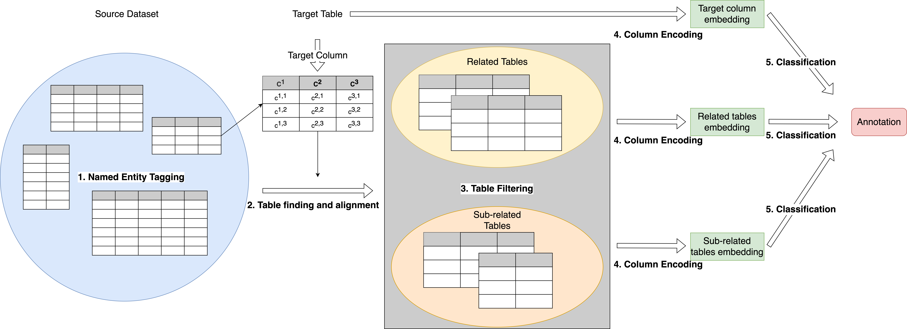

# RECA
This is the repository for the code and data of the VLDB 2023 paper: [RECA: Related Tables Enhanced Column Semantic Type Annotation Framework](https://dl.acm.org/doi/10.14778/3583140.3583149).




## Install

```console
$ git clone [link to repo]
$ cd RECA
$ pip install -r requirements.txt 
```

If you are using Anaconda, you can create a virtual environment and install all the packages:

```console
$ conda create --name RECA python=3.7
$ conda activate RECA
$ pip install -r requirements.txt
```

## Reproduce the results

In order to reproduce the results on Semtab2019 dataset, please go through the following steps:
1. Remove the init files in all the directories (they are created for placeholding purpose on github).
2. Download the pre-trained models and pre-processed data, please check the instructions in [checkpoints](https://github.com/ysunbp/RECA-paper/tree/main/Semtab/checkpoints) and [jsonl_data](https://github.com/ysunbp/RECA-paper/tree/main/Semtab/data/jsonl_data) for details. 
3. Tokenize the jsonl data, please follow the suggestions in [pre-process](https://github.com/ysunbp/RECA-paper/tree/main/Semtab/pre-process) (Alternatively, you can download the raw dataset from [here](http://www.cs.ox.ac.uk/isg/challenges/sem-tab/2019/#datasets) and pre-process the data from scratch. For detailed instructions please check [pre-process](https://github.com/ysunbp/RECA-paper/tree/main/Semtab/pre-process)).
4. Run the experiments, you can either load the pre-trained models and run [RECA-semtab-test-from-pre-trained.py](https://github.com/ysunbp/RECA-paper/blob/main/Semtab/experiment/RECA-semtab-test-from-pre-trained.py) or train from scratch by running [RECA-semtab-train+test.py](https://github.com/ysunbp/RECA-paper/blob/main/Semtab/experiment/RECA-semtab-train%2Btest.py)

In order to reproduce the results on WebTables dataset, please go through the following steps:
1. Remove the init files in all the directories (they are created for placeholding purpose on github).
2. Download the tokenized data or raw dataset, please check the instructions in [pre-process](https://github.com/ysunbp/RECA-paper/tree/main/WebTables/pre-process).
3. Pre-process the raw dataset if you want to star from the raw dataset, please follow the steps described in 'Start from scrtach' in [pre-process](https://github.com/ysunbp/RECA-paper/tree/main/WebTables/pre-process), you can skip this step if use the tokenized data directly.
4. Run the experiment file [RECA-webtables-train.py](https://github.com/ysunbp/RECA-paper/blob/main/WebTables/experiment/RECA-webtables-train.py) in the [experiment](https://github.com/ysunbp/RECA-paper/tree/main/WebTables/experiment) folder to start training.

## Repository Structure
```
RECA/
└── Semtab
    ├── checkpoints 
    ├── data 
        ├── distance-files (store the edit distances)
        ├── json (store the base json files that contain the table content)
        ├── jsonl_data (store the pre-process table data)
        ├── raw_data (the raw table dataset)
        └── tokenized_data (the tokenized data used for the experiments)
    ├── experiment
        ├── semtab_labels.json (class types)
        ├── RECA-semtab-test-from-pre-trained.py (directly reproduce the result by running this file)
        └── RECA-semtab-train+test.py (train the model from scratch)
    └── pre-process
        ├── transform_to_json.py (generate base json files from the raw data)
        ├── NER_extraction.py (NER tagging)
        ├── pre-process.py (table finding and alignment)
        ├── make_json_input.py (generate jsonl data)
        ├── jaccard_filterjson.py (table filtering)
        └── semtab-datasets.py (generate tokenized data)
└── WebTables
    ├── checkpoints
    ├── data
        ├── distance-files (store the edit distances)
        ├── json (store the base json files that contain the table content)
        ├── jaccard (store the jaccard distance)
        ├── webtables (the raw table dataset)
        ├── out (store the pre-process table data)
        └── tokenized_data (the tokenized data used for the experiments)
    ├── experiment
        ├── label_dict.json （class types）
        └── RECA-webtables-train.py (train the model from scratch)
    └── pre-process
        ├── compute_jaccard.py (compute the jaccard distance between tables)
        ├── pre-process-webtables.py (table finding, alignment, filtering, generate json files)
        └── webtables-datasets.py (generate tokenized data)
└── requirements.txt

```
